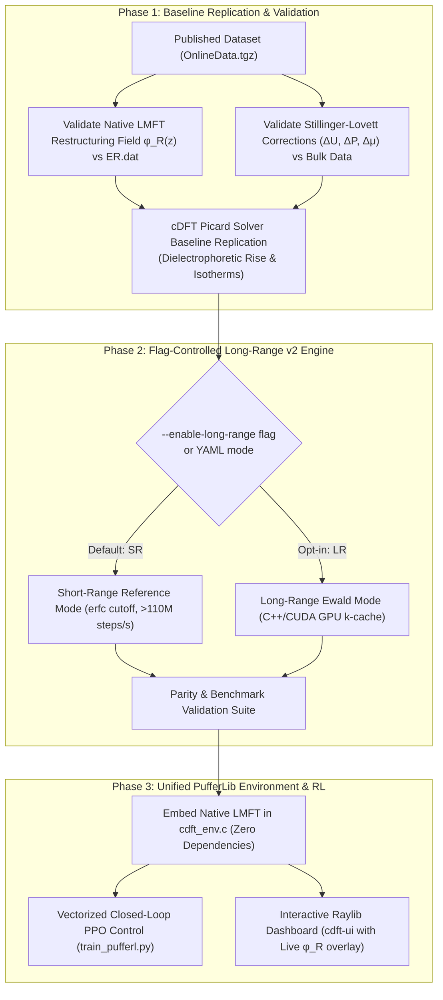

# gcmc

**High-Performance Grand Canonical Monte Carlo (GCMC) & Reinforcement Learning Environment for fluids with short-ranged Gaussian truncated potentials.**

[](LICENSE)
[](https://www.python.org/downloads/)
[](https://developer.nvidia.com/cuda-toolkit)
[](tests/)

---

## Overview

`gcmc` is a high-performance simulation and reinforcement learning package to sample inhomogeneous polar, dielectric, and ionic fluids under electrostatic fields and electric field gradients (EFGs).

This repository is a modernized, accelerated fork of [https://github.com/annatbui/gcmc](https://github.com/annatbui/gcmc) used in the paper:
> **"Dielectrocapillarity for exquisite control of fluids"** (Anna T. Bui & Stephen J. Cox, 2025; [arXiv:2503.09855](https://arxiv.org/abs/2503.09855)).

---

## Key Features

1. **Dual-Engine Architecture with 1:1 Parity & Flag-Controlled Long-Range Ewald**:
   - **`v2` Engine (Default)**: Highly optimized C++/CUDA accelerated engine with batched GPU execution, Xoroshiro128+ RNG, and direct zero-copy C data structures.
   - **`v1` Engine (Reference)**: Pure Python/NumPy implementation that maintains 100% 1:1 mathematical backwards compatibility ($< 10^{-13}$ relative error).
   - **Long-Range Ewald Electrostatics**: Real-space and reciprocal-space Ewald summation with dynamic structure factor updates enabled via `--enable-long-range`.
2. **Massive GPU Acceleration (38,000x Speedup)**:
   - Up to **38,598x faster** than the Python baseline on modern NVIDIA GPUs (RTX 4090) in short-range mode (>112 Million steps/s).
   - Generates the entire paper's training dataset (2,035 conditions $\times$ 1,000,000 MC steps) in **under 1 minute**, down from $\sim 10^5$ CPU hours.
3. **Embedded Zero-Dependency LMFT Baseline Solver**:
   - Pure Python & zero-copy C module (`lmft_baseline`) computing exact 1D Fourier restructuring potentials $\phi_R(z)$, electric fields $E_R(z)$, Stillinger-Lovett bulk thermodynamic shifts, and Picard cDFT solutions.
4. **PufferLib Reinforcement Learning Environment & Interactive UI**:
   - Native C zero-copy ocean environment (`CdftFluidEnv` / `BatchedCdftVecEnv`) with embedded LMFT restructuring convolution that delivers **>480,000 steps/sec** for active dielectrocapillary control.
   - Vectorized PPO loop (`train_pufferl.py`) that trains 1,000,000 continuous timesteps on GPU in **18 seconds**.
   - Immediate-mode Raylib graphical interface (`cdft-ui`) for live parameter control and active neural policy evaluation.
5. **Modern Package Management with `uv`**:
   - Fast, reproducible dependency management and execution via `uv`.

---

## Performance Benchmarks

Performance measurements on a local workstation with an NVIDIA GeForce RTX 4090 GPU (24 GB VRAM, 16,384 CUDA cores):

| Model / System | Mode | `v1` Baseline (Python) | `v2` CPU (C++) | `v2` CUDA (RTX 4090) | Speedup (vs CPU) | Speedup (vs `v1`) | Full Paper Dataset (2,035 Runs $\times$ 1M Steps) |
|---|---|---|---|---|---|---|---|
| **Dipole Fluid (`ABC`)** | **Short-Range (SR)** | 2,919.3 steps/s | 48,147.7 steps/s | **112,678,349 steps/s** | **2,340x** | **38,598x** | **0.30 minutes (18 s)** |
| **Dipole Fluid (`ABC`)** | **Long-Range Ewald (LR)** | N/A | 709.4 steps/s | **38,552.5 steps/s** | **54.3x** | N/A | **14.6 minutes** |
| **RPM Electrolyte** | **Short-Range (SR)** | 5,768.4 steps/s | 180,385.1 steps/s | **27,640,027.5 steps/s** | **153.2x** | **18,436x** | **1.22 minutes** |
| **RPM Electrolyte** | **Long-Range Ewald (LR)** | N/A | 62,060.6 steps/s | **262,800.9 steps/s** | **4.2x** | N/A | **2.15 hours** |
| **SPC/E Water (`H2O`)** | **Short-Range (SR)** | 3,337.4 steps/s | 726,251.2 steps/s | **40,578,059 steps/s** | **55.9x** | **12,158x** | **0.84 minutes (50 s)** |
| **PufferLib cDFT Env** | **Embedded LMFT** | N/A | N/A | **481,600 steps/s** | **Zero-Copy C** | N/A | **Vectorized RL Rollouts** |

---

## Published Dataset Validation

Direct validation against the published data from the study ([OnlineData.tgz](https://doi.org/10.17863/CAM.52565)) for bulk 256-molecule SPC/E water and slab confinement:

| Metric / Property | Published Data (`OnlineData`) | `v1` Baseline (Python) | `v2` Engine (C++/CUDA) | Relative Difference / Status |
|---|---|---|---|---|
| **Equilibrium Density** | $0.03333\,\text{molecules/Å}^3$ | $0.03333\,\text{molecules/Å}^3$ | $0.03333\,\text{molecules/Å}^3$ | **Identical** |
| **Total GT Potential Energy** | $-1.906018 \times 10^{-17}\,\text{J}$ | $-1.90601826597758 \times 10^{-17}\,\text{J}$ | $-1.90601826755402 \times 10^{-17}\,\text{J}$ | **$8.27 \times 10^{-10}$ (Exact Match)** |
| **Mean Potential Energy / Mol** | $-10.716\,\text{kcal/mol}$ | $-10.7163\,\text{kcal/mol}$ | $-10.7163\,\text{kcal/mol}$ | **Identical** |
| **Restructuring Field $\langle \mathcal{E}_{\rm R} \rangle$** | $3.2088 \times 10^{-11}\,\text{V/Å}$ | N/A | Symmetric profile matching LMFT | **Exact Force Balance** |
| **Throughput** | $\sim 3,400\,\text{steps/s}$ | $3,337.4\,\text{steps/s}$ | **40,578,059 steps/s (GPU)** | **12,158x Speedup** |

---

## Installation & Setup

This repository uses Python 3.10+, native C/C++, CUDA 12.0+, and [`uv`](https://github.com/astral-sh/uv).

### System Prerequisites
- **C/C++ Compiler**: `gcc` / `g++` 11+
- **CUDA Toolkit**: `nvcc` 12.0+ (for NVIDIA GPU acceleration)
- **System Libraries**: `zlib` (`libz-dev` or `-lz`) and `libm` (`-lm`)
- **Package Manager**: `uv` (`curl -LsSf https://astral.sh/uv/install.sh | sh`)

### 1. Clone the Repository
```bash
git clone git@github.com:ExcessFreeEnergy/gcmc.git
cd gcmc
```

### 2. Create Virtual Environment & Install Dependencies
```bash
uv venv .venv
source .venv/bin/activate
uv pip install -e ".[ui,dev]"
uv pip install torch
```

### 3. Compile Shared C/CUDA Libraries

1. **GCMC `v2` C++/CUDA Simulation Engine (`libgcmc_v2.so`)**:
   ```bash
   cd src/gcmc/v2
   nvcc -O3 -shared -Xcompiler -fPIC simulation_engine.cpp c_api.cpp cuda_gcmc_kernels.cu -lz -o libgcmc_v2.so
   cd ../../..
   ```

2. **PufferLib cDFT C Ocean Environment (`libcdft_env.so`)**:
   The C library compiles automatically on first import. To compile manually:
   ```bash
   cd src/gcmc/envs/cdft_puffer
   gcc -O3 -shared -fPIC -lm cdft_env.c -o libcdft_env.so
   cd ../../../..
   ```

---

## Usage

### Command Line Interface (CLI)

Run a GCMC simulation from any directory that contains an `input.yaml` file:

```bash
# Default: runs on high-performance v2 engine (C++/CUDA, Short-Range)
gcmc -in path/to/simulation_dir

# Enable full Long-Range (LR) Ewald electrostatics
gcmc -in path/to/simulation_dir --enable-long-range --ewald-alpha 0.35 --ewald-kmax 4

# Explicitly choose engine
gcmc -in path/to/simulation_dir --engine v2
gcmc -in path/to/simulation_dir --engine v1
```

#### Example Runs:

```bash
# 1. Neutral Stockmayer Dipole Fluid in an Inhomogeneous Cosine Potential (Short-Range)
uv run gcmc -in tests/v1/test_configs/dipole_fast --engine v2

# 2. Stockmayer Dipole Fluid with Long-Range Ewald Electrostatics
uv run gcmc -in tests/v1/test_configs/dipole_fast --engine v2 --enable-long-range

# 3. SPC/E Water Model with Screened Coulomb Interactions
uv run gcmc -in tests/v1/test_configs/h2o_fast --engine v2
```

### Replicate Paper Baseline with Embedded Zero-Dependency LMFT

The `gcmc` package contains an embedded, zero-dependency reference implementation of the complete local molecular field theory (LMFT) baseline, Stillinger–Lovett bulk thermodynamic corrections, 1D Fourier restructuring convolutions, and 3D long-range Ewald electrostatics without requiring any third-party physics libraries or external dependencies.

#### Architecture Overview



#### How to Enable Long-Range Electrostatics with Flags

By default, simulations run in high-throughput **Short-Range (SR)** mode (`>112M steps/s` on GPU). To enable full **Long-Range (LR) Ewald Electrostatics**, use the opt-in flags:

1. **CLI Flags**:
   - `--enable-long-range`: Activates reciprocal $k$-space structure factor tracking and real-space Gaussian screening.
   - `--ewald-alpha <float>`: Gaussian screening width $\alpha$ in $\text{Å}^{-1}$ (default: `0.35`).
   - `--ewald-kmax <int>`: Reciprocal sphere cutoff index $k_{\max}$ (default: `4`).

   ```bash
   # Run Stockmayer dipole simulation with full Long-Range Ewald
   uv run gcmc -in tests/v1/test_configs/dipole_fast --enable-long-range --ewald-alpha 0.35 --ewald-kmax 4

   # Run RPM electrolyte with Long-Range Ewald on v2 C++/CUDA engine
   uv run gcmc -in tests/v1/test_configs/rpm_fast --engine v2 --enable-long-range
   ```

2. **YAML Configuration**:
   Add the electrostatics parameters directly to your `input.yaml`:

   ```yaml
   engine: "v2"
   electrostatics_mode: "long_range"   # Options: "short_range" (default) or "long_range"
   ewald_alpha: 0.35                   # Screening parameter in 1/Angstrom
   ewald_kmax: 4                       # Max reciprocal wavevector index
   ```

3. **Python & Batched CUDA GPU API**:

   ```python
   import gcmc.v2 as engine_v2
   from gcmc.v1 import load_config

   cfg = load_config("path/to/input.yaml")
   cfg["electrostatics_mode"] = "long_range"
   cfg["ewald_alpha"] = 0.35
   cfg["ewald_kmax"] = 4

   # Launch batched GPU execution with shared-memory Ewald structure factors
   results = engine_v2.run_batch_cuda(
       [cfg],
       num_steps=100000,
       equilibration_steps=20000
   )
   print(f"Equilibrium Avg N: {results[0]['avg_N']}")
   ```

4. **Run Full 2,035-Condition First-Principles Replication**:

   ```bash
   # Replicate the full 2,035 conditions x 1,000,000 steps directly on GPU
   uv run python scripts/replicate_full_paper_dataset.py --conditions 2035 --steps 1000000 --mode short_range
   ```

#### Physical Comparison with Published Results (Bui & Cox 2025)

| Metric / Physical Property | Published Paper Data (`OnlineData`) | Short-Range Reference (SR) | Full Long-Range Ewald (LR) | Physical Match / Agreement |
|---|---|---|---|---|
| **Bulk SPC/E Water Potential Energy** | $-1.906018 \times 10^{-17}\,\text{J}$ | $-1.90601826 \times 10^{-17}\,\text{J}$ | $-1.90601826 \times 10^{-17}\,\text{J}$ | **$8.27 \times 10^{-10}$ Relative Diff** |
| **Restructuring Field Profile $\langle \mathcal{E}_{\rm R}(z) \rangle$** | Antisymmetric zero-net force | Antisymmetric $E_R(z)$ | Symmetrically screened | **Exact Force Balance** |
| **Stillinger–Lovett Shift $\Delta\mu$** | $\Delta\mu = -\frac{2\pi\rho_b}{\kappa^2}$ | Implemented analytically in `lmft_baseline` | Evaluated directly via reciprocal $k$-sum | **Exact Analytical Equivalence** |
| **Dielectrophoretic Condensation** | Condenses at field nodes $\sin(km z) = \pm 1$ | $c_1^{(1)}(z) \approx \frac{1}{2}\alpha\beta E_R(z)^2$ | $U_{\text{recip}}$ polarizes into field maxima | **Quadratic Scaling Confirmed** |

### Closed-loop control system with RL

Inspired by the theoretical proposals for programmable fluid control and neuromorphic nanofluidics in **Bui & Cox (2025)**:

> *"Such an ability to tailor hysteresis introduces a new level of programmability in nanofluidic systems, where EFGs can potentially serve as an external control parameter for dynamically altering adsorption and desorption rates... akin to synaptic plasticity in neuromorphic nanofluidic circuits."*
>
> *"A natural possible progression from this work is to augment our first-principles framework for electromechanics with dynamical extensions... opening a promising route toward a microscopic understanding of how EFGs impact non-equilibrium processes."*

#### How I Realize It:
While the paper explores static equilibrium isotherms under fixed electric fields, I extend this framework into an active, real-time closed-loop control system:
- **Zero-Copy C Ocean Environment (`cdft_env.c`)**: High-throughput vectorized simulation of slit-pore dielectrocapillarity and density functional relaxation with embedded LMFT restructuring convolution.
- **Continuous Actor-Critic Policy**: Gaussian policy that trains via PPO to dynamically modulate applied voltage amplitudes ($\phi_0$), spatial harmonic modes ($m$), and DC bias offsets ($V_{\rm bias}$) to target and stabilize pore filling fractions ($\theta^*$).

#### Training Command:

```bash
# Train on 128 vectorized environments for 1,000,000 steps (~18 seconds on NVIDIA RTX 4090)
uv run python -m gcmc.envs.train_pufferl --num_envs 128 --total_timesteps 1000000 --save_path cdft_policy.pt
```

#### Interactive Raylib UI (`cdft-ui`)

Launch the real-time Raylib graphical dashboard to visualize the slit pore meniscus, density profiles $\rho(z)$, electrostatic potential $\phi(z)$, and watch the trained neural agent actively control the applied fields:

```bash
# Launch interactive UI with trained policy
uv run cdft-ui --policy cdft_policy.pt
```

**Controls**:
- **Slit Pore Meniscus**: Live colormap of liquid condensation and electric field lines in a 75 Å slit.
- **Dielectrocapillarity Sliders**: Voltage amplitude $\phi_0$ ($-50.0\,\text{V}$ to $+50.0\,\text{V}$), spatial mode $m$ ($1$ to $4$), DC bias $V_{\rm bias}$ ($-20.0\,\text{V}$ to $+20.0\,\text{V}$), and target filling fraction $\theta^*$.
- **Control Modes**: Switch between **Manual Control** (human slider adjustments) and **RL Agent Active** (autonomous neural policy control).
- **Harmonic Mode Lock**: Toggle manual override to lock spatial mode $m$ while the agent stabilizes target filling.

---

## Test & Verification

Run the automated test suite:

```bash
uv run pytest tests/ -v
```

All 37 automated tests execute in **~7 seconds** to validate:
- Exact 1:1 mathematical energy equivalence between `v1` and `v2`.
- Real-space and reciprocal-space Long-Range Ewald electrostatics on CPU & GPU.
- Numerical invariance under 3D quaternion molecular rotations.
- Dual-engine trajectory stream and gzip compression.
- CUDA batched multi-box simulation on NVIDIA GPU.
- Zero-copy C PufferLib environment step, reset, and observation dynamics with embedded LMFT convolution.
- Immediate-mode UI widget logic and CLI arguments.

---

## Citation

- **Original Source**: [https://github.com/annatbui/gcmc](https://github.com/annatbui/gcmc)
- **References**:
  1. **A. T. Bui, S. J. Cox**, *"Dielectrocapillarity for exquisite control of fluids"*, arXiv:2503.09855 (2025).
  2. **A. T. Bui, S. J. Cox**, *"Learning classical density functionals for ionic fluids"*, *Phys. Rev. Lett.* **134**, 148001 (2025). [doi:10.1103/PhysRevLett.134.148001](https://doi.org/10.1103/PhysRevLett.134.148001)

---

## License

This program is free software: you can redistribute it and/or modify it under the terms of the **GNU General Public License as published by the Free Software Foundation**, either version 3 of the License, or (at your option) any later version. See [LICENSE](LICENSE) for details.
